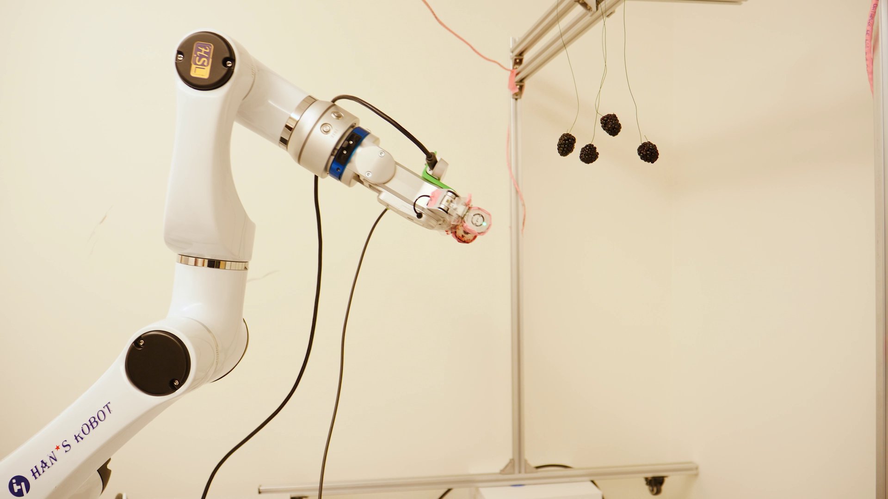
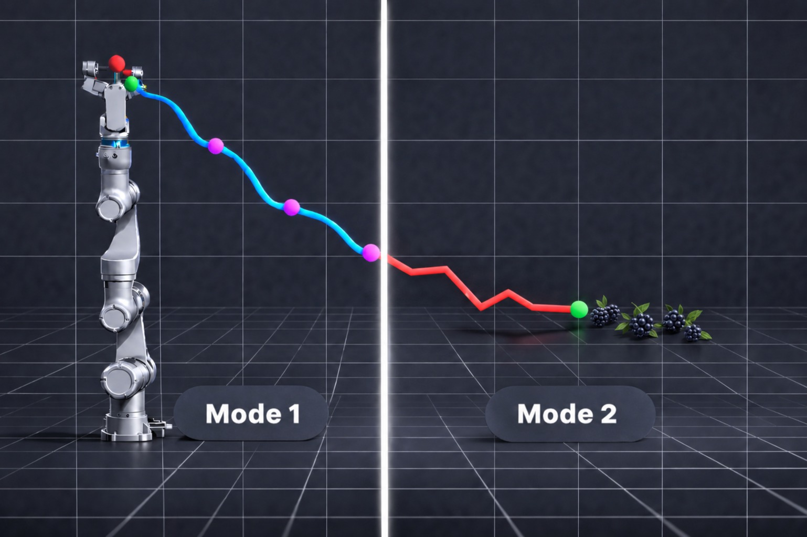
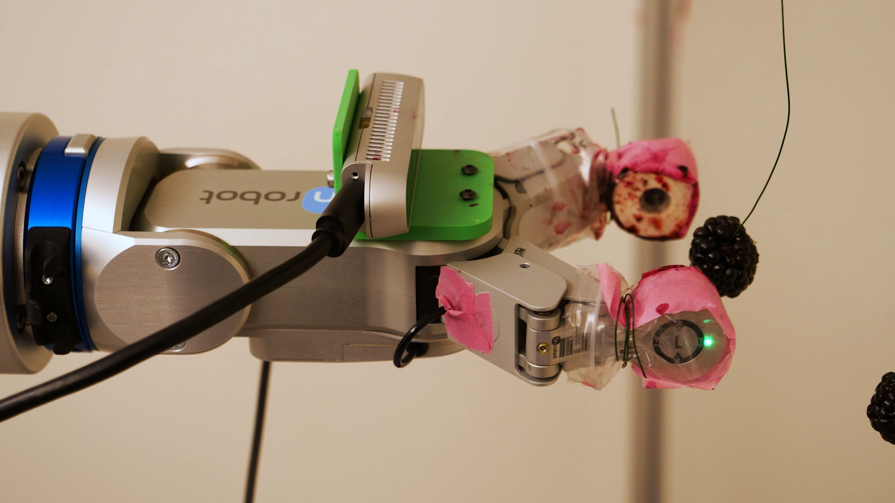
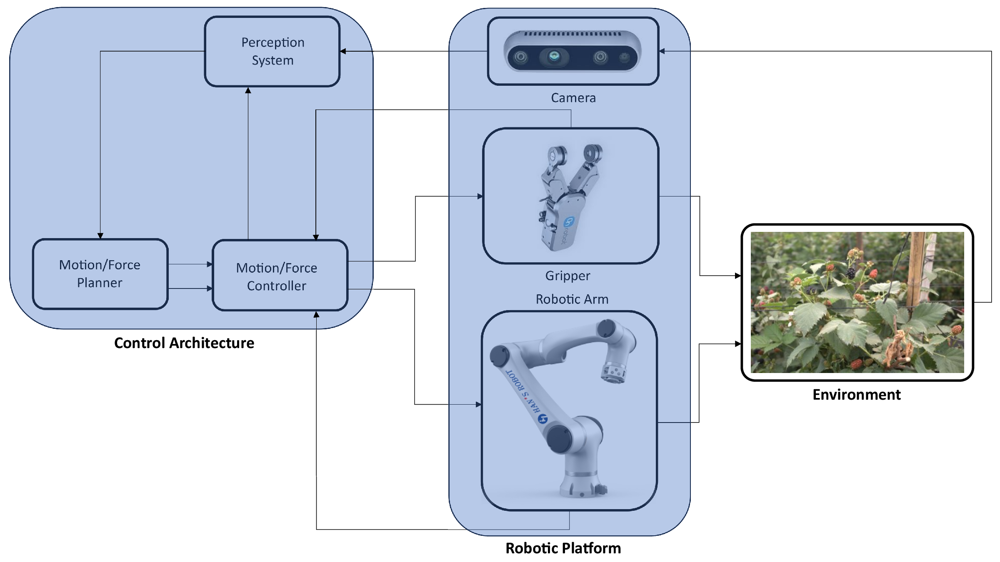

# Berry Harvesting Robot — Elfin3

ROS 2 workspace for vision-guided blackberry harvesting with a **Han's Robot Elfin3 manipulator**, an **OnRobot RG2-FT gripper**, and an **Intel RealSense RGB-D camera** in an eye-in-hand configuration.

This README documents the `main` branch, which contains the Elfin3 implementation of the harvesting architecture.



## Table of Contents

- [System Overview](#system-overview)
- [Robotic Platform](#robotic-platform)
- [Software Architecture](#software-architecture)
- [External Dependencies](#external-dependencies)
- [Installation](#installation)
- [Build](#build)
- [Hardware Configuration](#hardware-configuration)
- [Running the System](#running-the-system)
- [Common Use Cases](#common-use-cases)
- [Main ROS Nodes](#main-ros-nodes)
- [Basic ROS Commands](#basic-ros-commands)
- [Frequently Used Parameters](#frequently-used-parameters)
- [Eye-in-Hand Calibration](#eye-in-hand-calibration)
- [RG2-FT Calibration and Grasp](#rg2-ft-calibration-and-grasp)
- [Mode 2 and Custom OMPL](#mode-2-and-custom-ompl)
- [Troubleshooting](#troubleshooting)
- [Repository Structure](#repository-structure)
- [References and License](#references-and-license)
- [Developer Notes and Future Improvements](#developer-notes-and-future-improvements)

## System Overview

The harvesting sequence is divided into two coordinated operating modes.



### Mode 1 — cluster approach

1. `camera_node` publishes aligned RGB and depth data from the RealSense camera.
2. `mode1_vision_node` detects blackberries with YOLOv4-tiny.
3. Valid 3D detections are grouped with DBSCAN to estimate the cluster center and radius.
4. `eyeinhand_node` transforms the camera-frame target into `elfin_base`.
5. `mode1_trajectory_node` projects the target and generates a sigmoid Cartesian path.
6. `control_node` converts Cartesian waypoints into Elfin3 joint trajectory commands.
7. The coordinator repeats perception and motion until the TCP-to-target distance reaches the Mode 2 transition threshold.

The default transition is `0.25 m` plus a `0.01 m` margin.

### Mode 2 — fruit approach and grasp

1. `mode2_vision_node` selects a ripe blackberry and estimates its 3D position.
2. `eyeinhand_node` publishes the target in the Elfin base frame.
3. `mode2_trajectory_node` plans a Cartesian waypoint stream with HyRRT and `HybridStateSpace`.
4. `control_node` executes the waypoint stream.
5. `gripper_node` calibrates the force offset, closes the RG2-FT, and regulates the grasp force.

The complete Mode 1 → Mode 2 sequence is coordinated by `master_node` and starts when `START` is published on `/master/cmd`.

## Robotic Platform

The `main` branch is organized around the following physical platform:

| Component | Role | Main interface |
| --- | --- | --- |
| **Han's Robot Elfin3** | Six-joint manipulator for camera positioning, Cartesian approach, and fruit harvesting | `/joint_states` and `/elfin_arm_controller/joint_trajectory` |
| **OnRobot RG2-FT** | Parallel gripper with force/torque sensing for contact detection, grasp, hold, and release | `/gripper/command` and `/left_wrench` |
| **Intel RealSense** | Aligned RGB-D sensing for detection and 3D target localization | Direct `pyrealsense2` access through `camera_node` |
| **Ubuntu workstation** | Runs perception, TF, trajectory generation, hybrid planning, control, and coordination | Ubuntu 22.04 and ROS 2 Humble |

The RealSense camera is mounted beside the RG2-FT gripper. This eye-in-hand arrangement keeps the sensor close to the harvesting target throughout both approach modes.



## Software Architecture



The principal data interfaces are:

| Data | Publisher | Consumer |
| --- | --- | --- |
| Aligned RGB and depth | `camera_node` | Mode 1 and Mode 2 perception |
| Camera-frame target | Vision nodes on `/camera_sphere` | `eyeinhand_node` |
| Cluster or fruit radius | Vision nodes on `/sphere_radius` | Mode 1 trajectory and visualization |
| Base-frame target | `eyeinhand_node` on `/target_base` | Mode 1 and Mode 2 planners |
| Cartesian waypoint | Trajectory nodes on `/trajectory/waypoint` | `control_node` |
| Joint trajectory | `control_node` | Elfin controller |
| RG2-FT wrench | External OnRobot driver on `/left_wrench` | `gripper_node` |
| Subsystem commands and status | `master_node` and subsystem nodes | High-level state machine |

The harvesting launch file starts the camera, perception, TF, trajectory, control, gripper, and coordinator nodes. Elfin EtherCAT bring-up and the OnRobot Modbus driver are started in separate terminals.

## External Dependencies

| Component | Purpose | Download or documentation |
| --- | --- | --- |
| Ubuntu 22.04 LTS | Reference operating system for ROS 2 Humble | [Ubuntu 22.04 downloads](https://releases.ubuntu.com/22.04/) |
| ROS 2 Humble | ROS middleware, messages, launch, TF, and ROS 2 control | [ROS 2 Humble installation](https://docs.ros.org/en/humble/Installation/Ubuntu-Install-Debs.html) |
| colcon | ROS 2 workspace build tool | [colcon tutorial](https://docs.ros.org/en/humble/Tutorials/Beginner-Client-Libraries/Colcon-Tutorial.html) |
| rosdep | ROS dependency resolver | [rosdep tutorial](https://docs.ros.org/en/humble/Tutorials/Intermediate/Rosdep.html) |
| Elfin ROS 2 stack | Elfin3 model, EtherCAT driver, controllers, MoveIt, and hardware bring-up | [`huayan-robotics/elfin_robot_ros2`](https://github.com/huayan-robotics/elfin_robot_ros2/tree/humble_ethercat), branch `humble_ethercat` |
| OnRobot RG2-FT ROS 2 driver | Modbus TCP communication, wrench feedback, and `RG2FTCommand` messages | [`GilbertoLopez26/OnRobot_RG2FT_ROS2_Driver`](https://github.com/GilbertoLopez26/OnRobot_RG2FT_ROS2_Driver) |
| Intel RealSense SDK 2.0 | Camera permissions, utilities, firmware support, and Python API | [librealsense](https://github.com/realsenseai/librealsense), [Linux installation](https://github.com/realsenseai/librealsense/blob/master/doc/installation.md), and [Python wrapper](https://github.com/realsenseai/librealsense/tree/master/wrappers/python) |
| Custom OMPL fork | HyRRT and `HybridStateSpace` used by Mode 2 | [`xu21beve/ompl`](https://github.com/xu21beve/ompl) |
| OMPL documentation | General OMPL build and API reference | [OMPL installation guide](https://ompl.kavrakilab.org/installation.html) |

## Installation

### 1. Install Ubuntu 22.04 and ROS 2 Humble

Install Ubuntu 22.04 and follow the [official ROS 2 Humble Debian-package instructions](https://docs.ros.org/en/humble/Installation/Ubuntu-Install-Debs.html).

Source ROS 2 in every new terminal:

```bash
source /opt/ros/humble/setup.bash
```

Install the common development, ROS, Elfin, and visualization dependencies:

```bash
sudo apt update
sudo apt install \
  build-essential \
  cmake \
  git \
  libgtk-3-dev \
  python3-colcon-common-extensions \
  python3-numpy \
  python3-opencv \
  python3-pip \
  python3-rosdep \
  python3-wxgtk4.0 \
  ros-humble-ament-cmake-python \
  ros-humble-ament-index-cpp \
  ros-humble-controller-manager \
  ros-humble-cv-bridge \
  ros-humble-gazebo-ros2-control \
  ros-humble-joint-trajectory-controller \
  ros-humble-kdl-parser \
  ros-humble-moveit \
  ros-humble-ros2-controllers \
  ros-humble-sensor-msgs-py \
  ros-humble-tf2-geometry-msgs \
  ros-humble-tf2-tools \
  ros-humble-xacro
```

Initialize `rosdep` once per workstation:

```bash
sudo rosdep init
rosdep update
```

If `rosdep` was initialized previously, run only `rosdep update`.

### 2. Create the ROS 2 workspace

```bash
mkdir -p ~/berry_ws/src
cd ~/berry_ws/src
```

Clone this repository from `main`:

```bash
git clone --branch main --single-branch \
  https://github.com/Flirizar05/berry_harvesting_robot.git
```

Clone the Elfin Humble EtherCAT stack:

```bash
git clone --branch humble_ethercat --single-branch \
  https://github.com/huayan-robotics/elfin_robot_ros2.git
```

Clone the OnRobot RG2-FT driver:

```bash
git clone \
  https://github.com/GilbertoLopez26/OnRobot_RG2FT_ROS2_Driver.git
```

The resulting workspace contains the harvesting packages, Elfin hardware packages, and RG2-FT messages and driver.

### 3. Install RealSense and Python dependencies

Follow the [librealsense Linux installation guide](https://github.com/realsenseai/librealsense/blob/master/doc/installation.md) to install the SDK, udev rules, and utilities for the workstation.

Install the Python packages used by the camera and external hardware stacks:

```bash
python3 -m pip install --user \
  pyrealsense2 \
  "pymodbus==2.1.0" \
  transforms3d
```

Verify the Python environment:

```bash
python3 -c "import pyrealsense2 as rs; print('RealSense devices:', len(rs.context().devices))"
python3 -c "import pymodbus; print('pymodbus:', pymodbus.__version__)"
python3 -c "import cv2, numpy; print('OpenCV:', cv2.__version__, 'NumPy:', numpy.__version__)"
```

Use `realsense-viewer` to confirm aligned color and depth acquisition. Close the viewer before starting `camera_node` because the project accesses the RealSense device directly through `pyrealsense2`.

### 4. Install the custom OMPL fork for Mode 2

Mode 2 uses the `HyRRT` planner and `HybridStateSpace` extensions provided by the custom OMPL fork.

Create the OMPL workspace:

```bash
mkdir -p ~/workspace/ompl_ws/src
git clone https://github.com/xu21beve/ompl.git \
  ~/workspace/ompl_ws/src/ompl
```

Configure, build, and install OMPL:

```bash
cmake \
  -S ~/workspace/ompl_ws/src/ompl \
  -B ~/workspace/ompl_ws/build/ompl \
  -DCMAKE_BUILD_TYPE=Release \
  -DCMAKE_INSTALL_PREFIX="$HOME/workspace/ompl_ws/install/ompl"

cmake --build ~/workspace/ompl_ws/build/ompl --parallel
cmake --install ~/workspace/ompl_ws/build/ompl
```

Verify the required files:

```bash
test -f ~/workspace/ompl_ws/src/ompl/src/ompl/control/planners/rrt/HyRRT.h
test -f ~/workspace/ompl_ws/src/ompl/src/ompl/base/spaces/HybridStateSpace.h
test -f ~/workspace/ompl_ws/install/ompl/lib/libompl.so
git -C ~/workspace/ompl_ws/src/ompl rev-parse HEAD
```

The Mode 2 CMake configuration currently defines three `CUSTOM_OMPL_*` paths in [`harvesting_robot_cpp/CMakeLists.txt`](harvesting_robot_cpp/CMakeLists.txt). Set those entries to the source, include, and library locations selected for the workstation.

### 5. Resolve workspace dependencies

```bash
cd ~/berry_ws
source /opt/ros/humble/setup.bash

rosdep install \
  --from-paths src \
  --ignore-src \
  --rosdistro humble \
  -r -y
```

## Build

### Full workspace build

```bash
cd ~/berry_ws
source /opt/ros/humble/setup.bash

export CMAKE_PREFIX_PATH="$HOME/workspace/ompl_ws/install/ompl:$CMAKE_PREFIX_PATH"

colcon build --symlink-install
source install/setup.bash
```

The Python package installs its launch files, YOLO model files, and Elfin3 URDF into the package share automatically.

Verify the installation:

```bash
share_dir=$(ros2 pkg prefix harvesting_robot)/share/harvesting_robot

ls "$share_dir/launch"
ls "$share_dir/models"
ls "$share_dir/urdf"

ros2 pkg executables harvesting_robot
ros2 pkg executables harvesting_robot_cpp
ros2 pkg executables onrobot_rg2ft_control
```

The model directory contains:

```text
blackberry.names
yolov4-tiny-custom.cfg
yolov4-tiny-custom_best.weights
```

### Rebuild the harvesting packages

Use a selective build after changing only the harvesting source:

```bash
cd ~/berry_ws
source /opt/ros/humble/setup.bash
export CMAKE_PREFIX_PATH="$HOME/workspace/ompl_ws/install/ompl:$CMAKE_PREFIX_PATH"

colcon build --symlink-install \
  --packages-select harvesting_robot harvesting_robot_cpp

source install/setup.bash
```

### Optional shell setup

The following lines may be added to `~/.bashrc` on the development workstation:

```bash
source /opt/ros/humble/setup.bash
export CMAKE_PREFIX_PATH="$HOME/workspace/ompl_ws/install/ompl:$CMAKE_PREFIX_PATH"
source ~/berry_ws/install/setup.bash
```

## Hardware Configuration

### Elfin3

The Elfin ROS 2 stack uses the vendor EtherCAT configuration and the dedicated Ethernet interface connected to the controller.

1. Place the vendor-provided `elfin_drivers.yaml` data in the location required by the [Elfin hardware instructions](https://github.com/huayan-robotics/elfin_robot_ros2/tree/humble_ethercat#usage-with-real-hardware).
2. Apply the corresponding values in `elfin_robot_bringup/config/elfin_arm_control.yaml`.
3. Set `elfin_ethernet_name` to the workstation interface connected to the Elfin controller.
4. Configure the PREEMPT_RT environment and process privileges used by the Elfin EtherCAT driver.
5. Use the Elfin control panel to clear faults and enable the servos.

The Elfin3 hardware launch is:

```bash
ros2 launch elfin3_ros2_moveit2 elfin3_moveit.launch.py
```

Confirm the hardware interfaces:

```bash
ros2 topic echo /joint_states --once
ros2 topic info /elfin_arm_controller/joint_trajectory --verbose
ros2 control list_controllers
```

The harvesting model expects `elfin_joint1` through `elfin_joint6` and uses `rg2ft_grasp_point` as the controlled TCP.

### OnRobot RG2-FT

The referenced driver communicates with the gripper over Modbus TCP. Its default network endpoint is `192.168.1.1:502`.

1. Connect the gripper and host to the same Ethernet subnet.
2. Start one Modbus driver instance.
3. Confirm the low-level command and wrench topics.

```bash
ros2 run onrobot_rg2ft_control onrobot_rg2ft_driver
```

From another terminal:

```bash
ros2 topic info /gripper/command --verbose
ros2 topic echo /left_wrench --once
```

The RG2-FT driver command scale used by this project is `0` for closed and `1000` for open.

A direct low-level open command is:

```bash
ros2 topic pub --once \
  /gripper/command onrobot_rg2ft_msgs/msg/RG2FTCommand \
  "{target_force: 20, target_width: 1000, control: 1}"
```

### Intel RealSense

1. Connect the camera through USB 3.
2. Install the librealsense udev rules.
3. Validate color and aligned depth with `realsense-viewer`.
4. Close the viewer before running the harvesting camera node.

The project publishes camera data in `camera_color_optical_frame`.

## Running the System

Follow the laboratory operating procedure for the Elfin3 cell, including workspace clearance, reduced-speed commissioning, and access to the hardware emergency stop.

### Terminal 1 — Elfin3 hardware

```bash
sudo chrt 10 bash

source /opt/ros/humble/setup.bash
source ~/berry_ws/install/setup.bash

ros2 launch elfin3_ros2_moveit2 elfin3_moveit.launch.py
```

Complete the Elfin fault-clear and servo-enable sequence, then confirm `/joint_states` and the trajectory controller.

### Terminal 2 — RG2-FT driver

```bash
source /opt/ros/humble/setup.bash
source ~/berry_ws/install/setup.bash

ros2 run onrobot_rg2ft_control onrobot_rg2ft_driver
```

### Terminal 3 — harvesting stack

```bash
source /opt/ros/humble/setup.bash
source ~/berry_ws/install/setup.bash
export CMAKE_PREFIX_PATH="$HOME/workspace/ompl_ws/install/ompl:$CMAKE_PREFIX_PATH"

ros2 launch harvesting_robot harvesting_system.launch.py
```

For a headless Mode 1 session:

```bash
ros2 launch harvesting_robot harvesting_system.launch.py \
  vision_show_preview:=false
```

### Terminal 4 — monitor and command

Monitor the coordinator:

```bash
ros2 topic echo /master/status
```

Start one harvesting cycle:

```bash
ros2 topic pub --once \
  /master/cmd std_msgs/msg/String "{data: START}"
```

Request a coordinated software stop:

```bash
ros2 topic pub --once \
  /master/cmd std_msgs/msg/String "{data: STOP}"
```

Release the gripper:

```bash
ros2 topic pub --once \
  /master/cmd std_msgs/msg/String "{data: RELEASE}"
```

Monitor subsystem status:

```bash
ros2 topic echo /vision/status
ros2 topic echo /eyeinhand/status
ros2 topic echo /trajectory/status
ros2 topic echo /control/status
ros2 topic echo /potentialfields/status
ros2 topic echo /hyrrt/status
ros2 topic echo /gripper/status
```

The software `STOP` command coordinates the ROS subsystems. The hardware emergency stop remains the emergency control for the robot cell.

## Common Use Cases

### Camera only

Run the RealSense node independently:

```bash
source /opt/ros/humble/setup.bash
source ~/berry_ws/install/setup.bash

ros2 run harvesting_robot camera_node
```

Expected topics:

```text
/camera/color/image_raw
/camera/aligned_depth/image_raw
/camera/color/camera_info
/camera/aligned_depth/camera_info
/camera/depth/points
/camera/depth_scale
```

Inspect camera output:

```bash
ros2 topic hz /camera/color/image_raw
ros2 topic echo /camera/depth_scale --once
```

### Mode 1 perception only

Start the camera and Mode 1 vision nodes in separate terminals:

```bash
ros2 run harvesting_robot camera_node
```

```bash
ros2 run harvesting_robot mode1_vision_node
```

Trigger one capture:

```bash
ros2 topic pub --once \
  /vision/cmd std_msgs/msg/String "{data: CAPTURE}"
```

Inspect the result:

```bash
ros2 topic echo /vision/status
ros2 topic echo /camera_sphere
ros2 topic echo /sphere_radius
```

### Eye-in-hand TF inspection

With Elfin TF running:

```bash
ros2 launch harvesting_robot eyeinhand.launch.py
```

Inspect the frame chain:

```bash
ros2 run tf2_ros tf2_echo elfin_base camera_color_optical_frame
ros2 run tf2_ros tf2_echo elfin_base rg2ft_grasp_point
```

### Gripper standalone calibration

Start the external OnRobot driver and the harvesting gripper node:

```bash
ros2 run onrobot_rg2ft_control onrobot_rg2ft_driver
```

```bash
ros2 run harvesting_robot gripper_node
```

Monitor status and request calibration:

```bash
ros2 topic echo /gripper/status
```

```bash
ros2 topic pub --once \
  /gripper/cmd std_msgs/msg/String "{data: CALIBRATE}"
```

### RViz visualization

A reference RViz configuration is included in the repository:

```bash
rviz2 -d \
  ~/berry_ws/src/berry_harvesting_robot/docs/rviz/elfin3_moveit2.rviz
```

## Main ROS Nodes

| Node | Package | Purpose |
| --- | --- | --- |
| `camera_node` | `harvesting_robot` | Reads aligned RealSense RGB-D frames and publishes camera information, depth scale, and an optional point cloud |
| `mode1_vision_node` | `harvesting_robot` | Detects berries, clusters 3D observations, and publishes the Mode 1 target sphere |
| `mode2_vision_node` | `harvesting_robot` | Selects a ripe fruit and publishes the close-range Mode 2 target |
| `eyeinhand_node` | `harvesting_robot` | Transforms targets from the camera optical frame into `elfin_base` |
| `mode1_trajectory_node` | `harvesting_robot` | Generates the projected sigmoid Mode 1 Cartesian path |
| `mode2_trajectory_node` | `harvesting_robot_cpp` | Generates a Mode 2 Cartesian waypoint stream with custom OMPL HyRRT |
| `control_node` | `harvesting_robot` | Converts Cartesian waypoints into Elfin3 joint trajectory commands |
| `gripper_node` | `harvesting_robot` | Calibrates force offset and manages grasp, hold, release, and feedback |
| `master_node` | `harvesting_robot` | Coordinates homing and the complete Mode 1 → Mode 2 harvesting state machine |

## Basic ROS Commands

List active nodes and topics:

```bash
ros2 node list
ros2 topic list
```

Monitor the high-level coordinator:

```bash
ros2 topic echo /master/status
```

Start, stop, or release:

```bash
ros2 topic pub --once /master/cmd std_msgs/msg/String "{data: START}"
ros2 topic pub --once /master/cmd std_msgs/msg/String "{data: STOP}"
ros2 topic pub --once /master/cmd std_msgs/msg/String "{data: RELEASE}"
```

Trigger Mode 1 perception:

```bash
ros2 topic pub --once /vision/cmd std_msgs/msg/String "{data: CAPTURE}"
```

Trigger Mode 2 perception:

```bash
ros2 topic pub --once /potentialfields/cmd std_msgs/msg/String "{data: CAPTURE}"
```

Transform the latest camera target:

```bash
ros2 topic pub --once /eyeinhand/cmd std_msgs/msg/String "{data: COMPUTE}"
```

Plan a Mode 1 trajectory and execute one waypoint sequence:

```bash
ros2 topic pub --once /trajectory/cmd std_msgs/msg/String "{data: PLAN}"
ros2 topic pub --once /control/cmd std_msgs/msg/String "{data: EXECUTE}"
```

Plan Mode 2 and execute the waypoint stream:

```bash
ros2 topic pub --once /hyrrt/cmd std_msgs/msg/String "{data: RESET}"
ros2 topic pub --once /hyrrt/cmd std_msgs/msg/String "{data: PLAN}"
ros2 topic pub --once /control/cmd std_msgs/msg/String "{data: EXECUTE_STREAM}"
```

Command the harvesting gripper node:

```bash
ros2 topic pub --once /gripper/cmd std_msgs/msg/String "{data: CALIBRATE}"
ros2 topic pub --once /gripper/cmd std_msgs/msg/String "{data: GRASP}"
ros2 topic pub --once /gripper/cmd std_msgs/msg/String "{data: RELEASE}"
```

Inspect active parameters:

```bash
ros2 param dump /camera_node
ros2 param dump /eyeinhand_node
ros2 param dump /control_node
ros2 param dump /gripper_node
ros2 param dump /master_node
```

## Frequently Used Parameters

Show the arguments accepted by the complete launch:

```bash
ros2 launch harvesting_robot harvesting_system.launch.py --show-args
```

### `harvesting_system.launch.py`

| Group | Argument | Default | Purpose |
| --- | --- | --- | --- |
| Robot | `base_frame` | `elfin_base` | Planning and control reference frame |
| Robot | `joint_state_topic` | `/joint_states` | Elfin joint feedback |
| Robot | `controller_topic` | `/elfin_arm_controller/joint_trajectory` | Elfin trajectory command interface |
| Robot | `urdf_path` | installed `elfin3.urdf` | Kinematic model |
| Robot | `ee_link` | `rg2ft_grasp_point` | Controlled TCP |
| Camera | `depth_width` / `depth_height` | `640` / `480` | Aligned depth resolution |
| Camera | `color_width` / `color_height` | `640` / `480` | RGB resolution |
| Camera | `camera_fps` | `30` | RealSense stream rate |
| Camera | `camera_publish_rate` | `30.0` | ROS publication rate |
| Vision | `vision_show_preview` | `true` | Mode 1 OpenCV preview |
| Mode 1 | `projection_distance_m` | `0.15` | Projected approach distance |
| Control | `dt` | `0.02` | Controller update period |
| Control | `command_horizon_sec` | `0.05` | Joint trajectory command horizon |
| Control | `kp_pos` / `kp_ori` | `10.0` / `0.5` | Position and orientation gains |
| Control | `damp_pos` / `damp_ori` | `0.1` / `0.05` | Weighted DLS damping |
| Control | `max_joint_step_rad` | `0.02` | Per-cycle joint increment limit |
| Control | `pos_tol_m` | `0.04` | Cartesian waypoint tolerance |
| Control | `settle_cycles` | `20` | Consecutive cycles within tolerance |
| Control | `enable_nullspace` | `true` | Joint-limit null-space behavior |
| Control | `nullspace_gain` | `1.0` | Null-space correction gain |
| Control | `limit_margin_rad` | `0.30` | Joint-limit activation margin |
| Mode 2 | `hyrrt_waypoint_tol_m` | `0.15` | Waypoint tolerance |
| Mode 2 | `hyrrt_goal_tol_m` | `0.02` | Goal tolerance |
| Mode 2 | `hyrrt_planning_time` | `60.0` | Planning time |
| Mode 2 | `hyrrt_max_cartesian_vel` | `0.10` | Cartesian velocity bound |
| Mode 2 | `hyrrt_flow_step` | `0.01` | Hybrid propagation step |
| Mode 2 | `hyrrt_waypoint_dt` | `0.01` | Waypoint stream period |

Example launch override:

```bash
ros2 launch harvesting_robot harvesting_system.launch.py \
  camera_fps:=30 \
  vision_show_preview:=false \
  projection_distance_m:=0.15 \
  kp_pos:=10.0 \
  hyrrt_planning_time:=60.0
```

### Common node startup parameters

| Node | Parameter | Default | Purpose |
| --- | --- | ---: | --- |
| `camera_node` | `publish_pointcloud` | `true` | Publish `/camera/depth/points` |
| `camera_node` | `pc_stride` | `2` | Point-cloud sampling stride |
| `camera_node` | `pc_min_depth_m` / `pc_max_depth_m` | `0.10` / `2.5` | Point-cloud depth interval |
| `mode2_vision_node` | `conf_thresh` | `0.6` | YOLO confidence threshold |
| `mode2_vision_node` | `nms_thresh` | `0.4` | Non-maximum suppression threshold |
| `mode2_vision_node` | `target_class_id` | `2` | Ripe-fruit class |
| `mode2_vision_node` | `min_valid_depth_m` / `max_valid_depth_m` | `0.10` / `2.00` | Valid target-depth interval |
| `mode1_trajectory_node` | `min_radius_m` / `max_radius_m` | `0.02` / `0.25` | Cluster-radius limits |
| `mode1_trajectory_node` | `T` / `dt_wp` | `10.0` / `0.10` | Sigmoid duration and waypoint time step |
| `master_node` | `stop_distance_m` | `0.25` | Mode 1 transition distance |
| `master_node` | `stop_margin_m` | `0.01` | Additional transition margin |
| `master_node` | `do_home_on_start` | `true` | Home the Elfin3 at cycle start |
| `master_node` | `home_joint_positions_rad` | `[-1.67, -0.52, -1.39, -0.15, 2.39, 2.77]` | Home joint configuration |
| `master_node` | `enable_mode2` | `true` | Include the Mode 2 sequence |
| `master_node` | `enable_gripper` | `true` | Include grasping after Mode 2 |

Parameters in this second table are declared by their nodes and loaded at startup. They can be supplied through ROS 2 parameter YAML files or the corresponding node `parameters` blocks.

## Eye-in-Hand Calibration

The eye-in-hand launch publishes the following transform chain:

```text
elfin_end_link
  -> tool0
  -> camera_link
  -> camera_color_optical_frame
```

The mount calibration defines `tool0 -> camera_link`.

### Camera mount extrinsics

| Launch argument | Default | Unit |
| --- | ---: | --- |
| `cam_x` | `-0.03325` | m |
| `cam_y` | `-0.03315` | m |
| `cam_z` | `0.11506` | m |
| `cam_roll` | `0.0` | rad |
| `cam_pitch` | `-1.57079632679` | rad |
| `cam_yaw` | `3.14159265359` | rad |

Launch with a calibrated transform:

```bash
ros2 launch harvesting_robot harvesting_system.launch.py \
  cam_x:=-0.03325 \
  cam_y:=-0.03315 \
  cam_z:=0.11506 \
  cam_roll:=0.0 \
  cam_pitch:=-1.57079632679 \
  cam_yaw:=3.14159265359
```

### Base-frame target offsets

After TF conversion, `eyeinhand_node` applies the following offsets in `elfin_base`:

| Parameter | Default | Unit |
| --- | ---: | --- |
| `x_offset_m` | `0.0` | m |
| `y_offset_m` | `0.0` | m |
| `z_offset_m` | `0.11` | m |
| `tf_timeout_sec` | `0.8` | s |
| `compute_timeout_sec` | `3.0` | s |
| `require_fresh_point` | `false` | — |

The target offsets are read on each `COMPUTE` command and can be adjusted while the state machine is idle:

```bash
ros2 param set /eyeinhand_node x_offset_m 0.0
ros2 param set /eyeinhand_node y_offset_m 0.0
ros2 param set /eyeinhand_node z_offset_m 0.11
```

### Calibration sequence

1. Fix the RealSense bracket, RG2-FT adapter, and Elfin flange assembly in their operating positions.
2. Determine the six `tool0 -> camera_link` extrinsic values through hand-eye calibration or direct metrology.
3. Start the stack with those six launch values.
4. Inspect the camera optical transform and the gripper TCP transform.
5. Compare a measured physical point with the corresponding RViz point.
6. Record the calibrated extrinsics and task offsets with the deployment configuration.

Useful TF commands:

```bash
ros2 run tf2_ros tf2_echo elfin_base camera_color_optical_frame
ros2 run tf2_ros tf2_echo elfin_base rg2ft_grasp_point
ros2 run tf2_tools view_frames
```

Inspect the transformed target:

```bash
ros2 topic echo /target_base
ros2 param get /eyeinhand_node z_offset_m
```

The `cam_*` values describe the physical mount. The `*_offset_m` values provide task-space target compensation after the camera point is expressed in the robot base frame.

## RG2-FT Calibration and Grasp

The harvesting gripper node receives force feedback from `/left_wrench` and publishes low-level commands on `/gripper/command`.

### Frequent gripper parameters

| Parameter | Default | Purpose |
| --- | ---: | --- |
| `offset_samples` | `50` | Samples used to calculate the force zero |
| `calib_open_before` | `true` | Open before collecting calibration samples |
| `calib_timeout_sec` | `3.0` | Calibration timeout |
| `force_ref` | `20.0 N` | Requested grasp force |
| `force_tol` | `2.0 N` | Force tolerance |
| `stable_cycles` | `50` | Cycles required for stable force |
| `use_force_contact` | `true` | Enable force contact detection |
| `min_contact_force` | `1.0 N` | Contact threshold |
| `contact_stable_cycles` | `25` | Consecutive contact cycles |
| `width_open` | `1000` | Open command |
| `width_closed` | `0` | Closed command |
| `width_init` | `900` | Initial width command |
| `kp` / `ki` / `kd` | `0.02` / `0.005` / `0.001` | Force PID gains |
| `grasp_timeout_sec` | `5.0` | Grasp timeout |
| `release_hold_sec` | `1.5` | Release command hold time |

The first `GRASP` request automatically calibrates the force offset. Calibration may also be triggered explicitly with the gripper unloaded.

Monitor status:

```bash
ros2 topic echo /gripper/status
```

Run calibration:

```bash
ros2 topic pub --once \
  /gripper/cmd std_msgs/msg/String "{data: CALIBRATE}"
```

A completed calibration publishes `BUSY`, `DONE_OK`, and `IDLE`. The compensated force and commanded width are available on:

```text
/gripper/debug_force_con
/gripper/debug_width
```

Test grasp and release:

```bash
ros2 topic pub --once /gripper/cmd std_msgs/msg/String "{data: GRASP}"
ros2 topic pub --once /gripper/cmd std_msgs/msg/String "{data: RELEASE}"
```

## Mode 2 and Custom OMPL

Mode 2 is implemented by:

```text
harvesting_robot_cpp/mode2_trajectory_node
```

The planner uses:

- Custom OMPL with `HyRRT`
- `HybridStateSpace`
- KDL kinematics
- The installed `elfin3.urdf`
- Target topic `/target_base`
- Waypoint topic `/trajectory/waypoint`

The main launch applies these defaults:

| Parameter | Default |
| --- | ---: |
| `hyrrt_waypoint_tol_m` | `0.15` |
| `hyrrt_goal_tol_m` | `0.02` |
| `hyrrt_planning_time` | `60.0` |
| `hyrrt_max_cartesian_vel` | `0.10` |
| `hyrrt_flow_step` | `0.01` |
| `hyrrt_waypoint_dt` | `0.01` |

The C++ node also declares the following Cartesian workspace:

| Parameter | Default |
| --- | --- |
| `ws_min` | `[-0.95, -0.9, 0.05]` |
| `ws_max` | `[0.40, 0.9, 0.90]` |
| `clamp_to_workspace` | `false` |

During normal operation, `master_node` triggers Mode 2 planning and `control_node` executes the returned waypoint stream.

Verify the custom OMPL installation at any time:

```bash
test -f ~/workspace/ompl_ws/src/ompl/src/ompl/control/planners/rrt/HyRRT.h
test -f ~/workspace/ompl_ws/src/ompl/src/ompl/base/spaces/HybridStateSpace.h
test -f ~/workspace/ompl_ws/install/ompl/lib/libompl.so
```

## Troubleshooting

### ROS cannot find the packages

Source ROS 2 and the workspace:

```bash
source /opt/ros/humble/setup.bash
source ~/berry_ws/install/setup.bash

ros2 pkg list | grep harvesting_robot
```

### YOLO configuration or weights cannot be opened

Confirm the installed model resources:

```bash
share_dir=$(ros2 pkg prefix harvesting_robot)/share/harvesting_robot
ls "$share_dir/models"
```

The directory contains `blackberry.names`, `yolov4-tiny-custom.cfg`, and `yolov4-tiny-custom_best.weights`.

### The Elfin3 does not move

Inspect the hardware and control interfaces:

```bash
ros2 control list_controllers
ros2 topic echo /joint_states --once
ros2 topic info /elfin_arm_controller/joint_trajectory --verbose
ros2 topic echo /control/status
```

Confirm that the Elfin control panel reports enabled servos and that the expected controller is active.

### RealSense does not start

Verify device enumeration:

```bash
python3 -c "import pyrealsense2 as rs; print(len(rs.context().devices))"
```

Confirm the udev installation, USB 3 connection, and that `realsense-viewer` or another camera process is closed.

### The target appears offset in RViz

Inspect both transforms and the target offsets:

```bash
ros2 run tf2_ros tf2_echo elfin_base camera_color_optical_frame
ros2 run tf2_ros tf2_echo elfin_base rg2ft_grasp_point
ros2 param get /eyeinhand_node x_offset_m
ros2 param get /eyeinhand_node y_offset_m
ros2 param get /eyeinhand_node z_offset_m
```

Compare the displayed target with a measured point and update the calibrated extrinsics or task offsets.

### The RG2-FT does not respond

Verify the network endpoint, Python dependency, driver, and ROS topics:

```bash
python3 -c "import pymodbus; print(pymodbus.__version__)"
ros2 node list | grep onrobot
ros2 topic info /gripper/command --verbose
ros2 topic echo /left_wrench --once
```

The referenced driver uses `pymodbus==2.1.0` and defaults to `192.168.1.1:502`.

### `harvesting_robot_cpp` does not build

Check the OMPL source, installed library, and configured paths:

```bash
test -f ~/workspace/ompl_ws/src/ompl/src/ompl/control/planners/rrt/HyRRT.h
test -f ~/workspace/ompl_ws/src/ompl/src/ompl/base/spaces/HybridStateSpace.h
test -f ~/workspace/ompl_ws/install/ompl/lib/libompl.so

grep CUSTOM_OMPL harvesting_robot_cpp/CMakeLists.txt
```

Then rebuild with the OMPL prefix:

```bash
export CMAKE_PREFIX_PATH="$HOME/workspace/ompl_ws/install/ompl:$CMAKE_PREFIX_PATH"
colcon build --symlink-install --packages-select harvesting_robot_cpp
```

### OpenCV windows fail on a headless computer

Disable the Mode 1 preview:

```bash
ros2 launch harvesting_robot harvesting_system.launch.py \
  vision_show_preview:=false
```

Set the Mode 2 `show_result` startup parameter to `false` in its node configuration for a fully headless session.

### High CPU usage from point-cloud publication

Set `publish_pointcloud` to `false` in the `camera_node` startup parameters, or increase `pc_stride`.

## Repository Structure

```text
berry_harvesting_robot/
├── harvesting_robot/
│   ├── harvesting_robot/
│   │   ├── camera_node.py
│   │   ├── control_node.py
│   │   ├── eyeinhand_node.py
│   │   ├── gripper_node.py
│   │   ├── master_node.py
│   │   ├── mode1_trajectory_node.py
│   │   ├── mode1_vision_node.py
│   │   └── mode2_vision_node.py
│   ├── launch/
│   │   ├── eyeinhand.launch.py
│   │   └── harvesting_system.launch.py
│   ├── models/
│   └── urdf/
│       └── elfin3.urdf
├── harvesting_robot_cpp/
│   └── src/
│       └── mode2_trajectory_node.cpp
├── robot_description/
│   └── xacro/
│       └── elfin3.urdf.xacro
└── docs/
    ├── images/
    └── rviz/
        └── elfin3_moveit2.rviz
```

## References and License

- [ROS 2 Humble documentation](https://docs.ros.org/en/humble/)
- [Elfin ROS 2 `humble_ethercat` branch](https://github.com/huayan-robotics/elfin_robot_ros2/tree/humble_ethercat)
- [OnRobot RG2-FT ROS 2 driver](https://github.com/GilbertoLopez26/OnRobot_RG2FT_ROS2_Driver)
- [Intel RealSense librealsense](https://github.com/realsenseai/librealsense)
- [Custom OMPL fork with HyRRT](https://github.com/xu21beve/ompl)
- [OMPL documentation](https://ompl.kavrakilab.org/)

The ROS packages in this repository declare the Apache-2.0 license in their package manifests.

## Developer Notes and Future Improvements

The following maintenance items are recommended for future development of the `main` branch:

- Replace the absolute `CUSTOM_OMPL_*` paths in `harvesting_robot_cpp/CMakeLists.txt` with configurable CMake cache variables or an imported OMPL target.
- Expose `master_node` options such as `enable_mode2`, `enable_gripper`, homing values, and timeout values as top-level launch arguments or a versioned parameter YAML file.
- Expose the RG2-FT calibration, force, width, PID, and timeout parameters through the main launch configuration.
- Forward `base_frame`, camera target topics, and eye-in-hand timing options into `eyeinhand.launch.py` so frame and topic overrides remain centralized.
- Add launch arguments for Mode 2 `show_result` and camera point-cloud publication to support headless and lower-CPU deployments directly from the command line.
- Keep package manifests synchronized with direct code dependencies, including `builtin_interfaces` and `sensor_msgs_py` in the Python package and `ament_index_cpp` in the C++ package.
- Synchronize RGB, aligned depth, and camera-information samples and use acquisition timestamps when transforming eye-in-hand targets.
- Add automated tests for perception edge cases, TF conversion, Elfin3 kinematics, joint-limit behavior, coordinator state transitions, and RG2-FT command/status handling.
- Add a ROS 2 Humble continuous-integration workflow for clean builds, linting, and headless interface tests.
- Maintain a versioned deployment profile containing the Elfin controller configuration, EtherCAT interface, camera firmware, camera extrinsics, gripper parameters, OMPL commit, and model versions.
